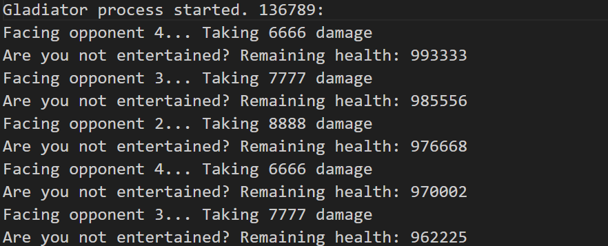
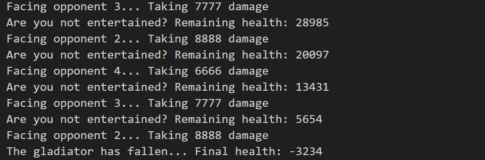
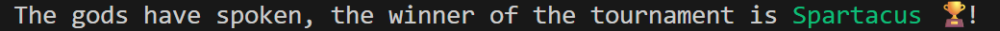

# Gladiator Tournament 🏟️  

⚔️ C program that simulates a gladiator tournament

## Table of Contents  

1. [About](#about)  
2. [Features](#features)  
3. [Requirements](#requirements)  
4. [Installation](#installation)  
5. [Usage](#usage)  

---

## About

The **Gladiator Tournament** is a C program that simulates a tournament between multiple gladiators.  
Each gladiator runs as a separate process and fights opponents according to predefined data files.  

The project demonstrates **process creation (fork)**, **program execution (execv)**, and **file I/O for logging**.

---

## Features

- Simulates multiple gladiators fighting in a tournament  
- Each gladiator runs as a separate process  
- Reads attributes (health, attack, opponents) from data files  
- Logs actions and outcomes to separate log files in `logs/`  
- Determines and announces the tournament winner

---

## Requirements

- A Linux, macOS, or Windows system with WSL for running C programs  
- GCC (GNU Compiler Collection) or another C compiler  
- Git (to clone the repository)  
- Make (to build the project)

---

## Installation
Follow these steps to set up the project locally:

---

### 1. Clone the repository
```bash
git clone https://github.com/Amit-Bruhim/Gladiator-Tournament.git
```
### 2. Navigate into the src folder
```bash
cd Gladiator-Tournament/src
```

### 3. Compile the program using Make
```bash
make
```

### 4. Run the main program
```bash
make run
```

---

## Usage

When you run the tournament program, log files for each gladiator (`log_G1.txt`, `log_G2.txt`, etc.) are created in the `logs/` directory.  
These log files show the details of each gladiator's fights.  

For this example, we will use the prepared data files in the `data/` directory, but users can modify the data there to change gladiator attributes.  

  

  

After the tournament ends, the winner of the battle is printed to the terminal.  

  


